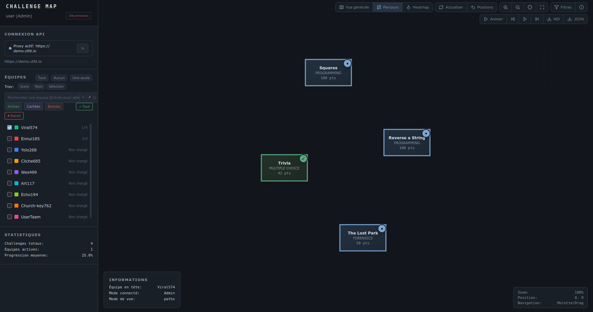

# CTF Challenge Map

[](https://github.com/MeltingBot/CTFdChallengeMap/releases)
[](LICENSE)
[](https://docs.ctfd.io/docs/api/getting-started/)
[](https://d3js.org/)
[](app.js)
[](proxy-server.js)
[](proxy.go)

Interface de visualisation interactive pour CTFd : carte des challenges avec dépendances, progression des équipes, analyse des temps de résolution. Thème sombre, sans framework — JavaScript vanilla + D3.js (embarqué, fonctionne hors ligne).



**Développé par :** Tungst - Oscar Zulu OSINT Crew

## Installation rapide

### Option 1 : Proxy Go (recommandé - plus léger)
```bash
# Compiler le proxy
go build -o ctfd-proxy proxy.go

# Lancer avec l'instance par défaut (demo.ctfd.io)
./ctfd-proxy

# Ou avec une instance spécifique
CTFD_URL=https://votre-ctfd.com ./ctfd-proxy

# Ou avec des options
./ctfd-proxy -ctfd-url=https://votre-ctfd.com -port=8080

# Accéder à l'interface
http://localhost:3000
```

### Option 2 : Proxy Node.js (alternative)
```bash
# Installer les dépendances
npm install

# Lancer le proxy
CTFD_URL=https://votre-ctfd.com npm start

# Accéder à l'interface
http://localhost:3000
```

### Option 3 : Extension navigateur
1. Installer l'extension "Allow CORS" ou "CORS Unblock"
2. Ouvrir `index.html` directement dans le navigateur
3. Activer l'extension uniquement pendant l'utilisation

## Configuration

### Obtenir un token API CTFd
1. Connectez-vous à votre instance CTFd
2. Allez dans Settings → Access Tokens
3. Créez un nouveau token
4. Copiez le token (format: `ctf_xxxxxxxxxxxx`)

### Types de tokens
- **Token utilisateur** : Vue limitée à votre équipe
- **Token admin** : Vue complète de toutes les équipes

## Utilisation

### Connexion
1. Ouvrez l'interface dans votre navigateur
2. Entrez l'URL de votre instance CTFd
3. Collez votre token API
4. Cliquez « Se connecter »

### Navigation dans l'interface
- **Sélection d'équipes** : cochez/décochez les équipes dans la sidebar gauche (recherche, tri par score/nom, filtres actives/cachées/bannies)
- **Barre d'outils** : deux rangées en haut à droite — modes de vue (Vue générale, Parcours, Heatmap), données (Actualiser, Positions), navigation (zoom, recentrer, ajuster) et outils (Filtres, À propos) ; les contrôles du Parcours apparaissent sur leur propre rangée
- **Navigation** : zoom à la molette, déplacement par glisser-déposer
- **Challenges** : cliquez pour voir le détail des résolutions, glissez pour repositionner (positions mémorisées)
- **Panneaux flottants** : la légende heatmap et le chronomètre du parcours se déplacent en les attrapant par leur titre

### Mode Parcours
1. Sélectionnez une ou plusieurs équipes
2. Cliquez sur « Parcours »
3. Les lignes colorées montrent la progression chronologique de chaque équipe, avec le **temps écoulé entre deux résolutions** affiché sur chaque flèche
4. Glissez les challenges : les lignes suivent en temps réel

#### Animation du parcours
- **Animer** : rejoue la progression chronologiquement, avec chronomètre et timeline
- **Lecture / pause** : suspend et reprend l'animation
- **Pas-à-pas** ⏮ / ⏭ : avance ou recule d'une résolution à la fois (utilisable sans lancer la lecture)
- **Vitesses** : ×0.5, ×1, ×2, ×5
- Les challenges restent déplaçables pendant l'animation

#### Export du parcours
- **MD** : rapport Markdown avec table de comparaison des équipes et détail chronologique (Δ entre résolutions, temps depuis le début, cumul de points)
- **JSON** : mêmes données en structure exploitable par script (durées en millisecondes et formatées)

### Mode Heatmap
1. Sélectionnez les équipes à analyser
2. Cliquez sur « Heatmap »
3. Observez les couleurs des challenges :
   - **Bleu** : résolus rapidement
   - **Rouge** : ont pris beaucoup de temps
   - **Gris** : non résolus par les équipes sélectionnées
4. Survolez pour voir les temps détaillés

### Filtres
1. Cliquez sur « Filtres »
2. Combinez les critères :
   - **Recherche** : par nom de challenge
   - **Catégories** : sélection multiple
   - **Difficulté** : plage de points
   - **Statut** : résolu, tenté, disponible, verrouillé
3. Les challenges non retenus apparaissent en transparence

## Fonctionnalités

### Interface
- Carte interactive des challenges avec flèches de dépendances
- Thème sombre sobre : statuts des challenges par couleur (résolu / tenté / disponible / verrouillé), couleurs distinctes par équipe (jusqu'à 16)
- Icônes [Lucide](https://lucide.dev/) embarquées en SVG (aucune ressource externe)
- D3.js embarqué localement : fonctionne hors ligne, compatible avec la CSP stricte des proxys
- Drag & drop des challenges avec positions persistées en session
- Tooltips détaillés, statistiques temps réel, fit-to-screen

### Analyse
- Détail des résolutions par challenge : classement, tentatives/échecs, temps écoulé dans le CTF, temps depuis déblocage, écart avec l'équipe précédente
- Heatmap des temps de résolution pour identifier les challenges bloquants
- Parcours chronologiques animés avec étiquettes de temps par segment
- Export MD/JSON pour comparer les performances des équipes

## Cas d'usage

### Pour les organisateurs de CTF
- **Analyse post-événement** : heatmap pour identifier les challenges trop difficiles
- **Suivi des équipes** : mode Parcours pour voir les stratégies de résolution
- **Équilibrage** : ajustez la difficulté en analysant les temps de résolution
- **Rapports** : export MD/JSON des parcours pour les débriefs

### Pour les participants
- **Stratégie d'équipe** : visualisez votre progression vs autres équipes
- **Performance** : analysez vos temps de résolution
- **Navigation** : vue claire des dépendances entre challenges

### Pour les éducateurs
- **Pédagogie** : montrez visuellement la progression d'apprentissage
- **Évaluation** : identifiez les concepts les plus difficiles
- **Retour d'expérience** : débriefing visuel après les exercices

## Dépannage

### Erreur CORS
- Utilisez un des deux proxys (Go ou Node.js)
- Ou installez une extension navigateur
- Ou configurez les headers CORS sur votre serveur CTFd

### Token invalide
- Vérifiez que le token est correct et non expiré
- Assurez-vous d'avoir les bonnes permissions

### URL incorrecte
- Vérifiez l'URL CTFd (avec https://)
- Testez l'accès direct à l'API : `https://votre-ctfd.com/api/v1/challenges`

## Développement

```
ctfdMap/
├── index.html             # Interface (UI, styles, tokens du thème sombre)
├── app.js                 # Logique applicative (API CTFd, état, filtres, exports)
├── app-d3.js              # Rendu D3 (force simulation, parcours, animation)
├── d3.v7.min.js           # D3.js vendorisé (v7.9.0)
├── build.js               # Minification Terser (npm run build)
├── proxy.go               # Serveur proxy Go (recommandé)
├── proxy-server.js        # Serveur proxy Node.js (alternative)
├── Makefile               # Compilation Go (build, build-all)
├── D3-IMPLEMENTATION.md   # Documentation du module D3
├── BUILD.md               # Documentation du build de production
└── README.md              # Ce fichier
```

Pas de framework, pas de bundler : les deux scripts communiquent via `window`. Le build de production (`npm run build`) génère `app.min.js`, `app-d3.min.js` et `index.prod.html`. Debug : ajoutez `?debug=true` à l'URL (frontend) ou `CTFDMAP_DEBUG=true` (proxy Node).

## Crédits

**Auteur :** Tungst - Oscar Zulu OSINT Crew

**Special Thanks :**
- Degun
- Rofellos  
- Grand Duc

## Licence

Ce projet est sous licence MIT. Voir le fichier [LICENSE](LICENSE) pour plus de détails.
